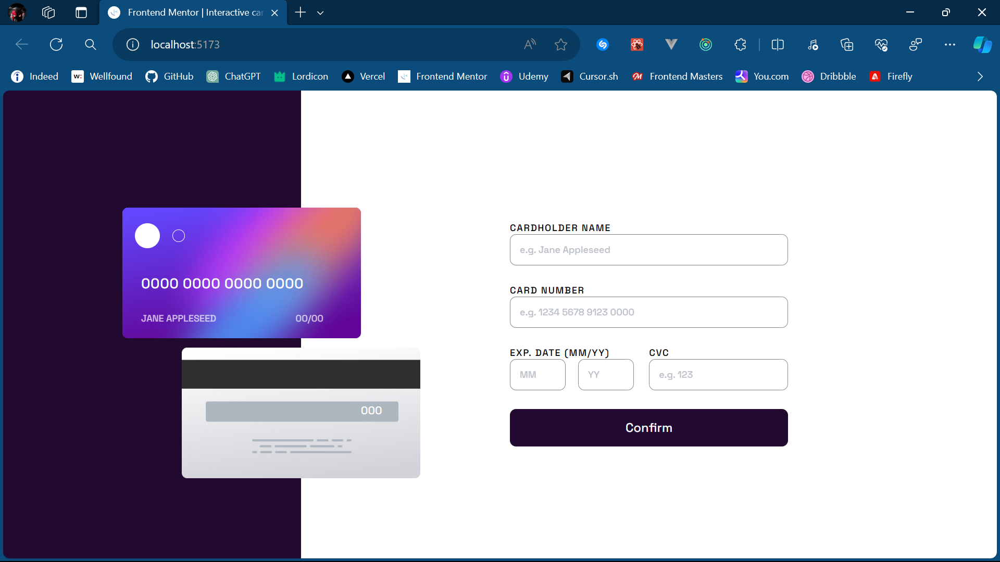

# Frontend Mentor - Interactive card details form solution

This is a solution to the [Interactive card details form challenge on Frontend Mentor](https://www.frontendmentor.io/challenges/interactive-card-details-form-XpS8cKZDWw). Frontend Mentor challenges help you improve your coding skills by building realistic projects. 

## Table of contents

- [Overview](#overview)
  - [The challenge](#the-challenge)
  - [Screenshot](#screenshot)
  - [Links](#links)
- [My process](#my-process)
  - [Built with](#built-with)
  - [What I learned](#what-i-learned)
  - [Continued development](#continued-development)
  - [Useful resources](#useful-resources)
- [Author](#author)
- [Acknowledgments](#acknowledgments)

## Overview

### The challenge

Users should be able to:

- Fill in the form and see the card details update in real-time
- Receive error messages when the form is submitted if:
  - Any input field is empty
  - The card number, expiry date, or CVC fields are in the wrong format
- View the optimal layout depending on their device's screen size
- See hover, active, and focus states for interactive elements on the page

### Screenshot

### Links

- Solution URL: [Live solution URL](https://github.com/Aniket200-ind/interactive-card-details-form-main)
- Live Site URL: [Live site URL](https://card-detailform.vercel.app/)

## My process

### Built with

- [React](https://reactjs.org/) - JS library
- [Tailwind](https://tailwindcss.com/) - CSS Framework
- [Redux toolkit](https://redux-toolkit.js.org/) - State management tool for react
-[React router dom](https://reactrouter.com/web/guides/quick-start) - Routing tool for react
- [React hook form](https://react-hook-form.com/) - Form validation tool for react
- [Zod](https://zod.dev/) - Zod is a TypeScript-first schema declaration and validation library.
- Semantic HTML5 markup
- Flexbox
- Mobile-first workflow

### What I learned

I learned how to use redux toolkit for state management in react. I also learned how to use tailwind css for styling. I also learned how to use react-router-dom for routing in react. I also learned how to use react-hook-form for form validation in react. I also learned how to use zod for making schema validation for form values.

### Continued development

I want to continue focusing on redux toolkit and tailwind css. I also want to learn more about react-router-dom and react-hook-form. I also want to learn more about zod. I also want to focus on validating a form.

## Author

- Frontend Mentor - [@Aniket200-ind](https://www.frontendmentor.io/profile/Aniket200-ind)
- Github - [@Aniket200-ind](https://github.com/Aniket200-ind)